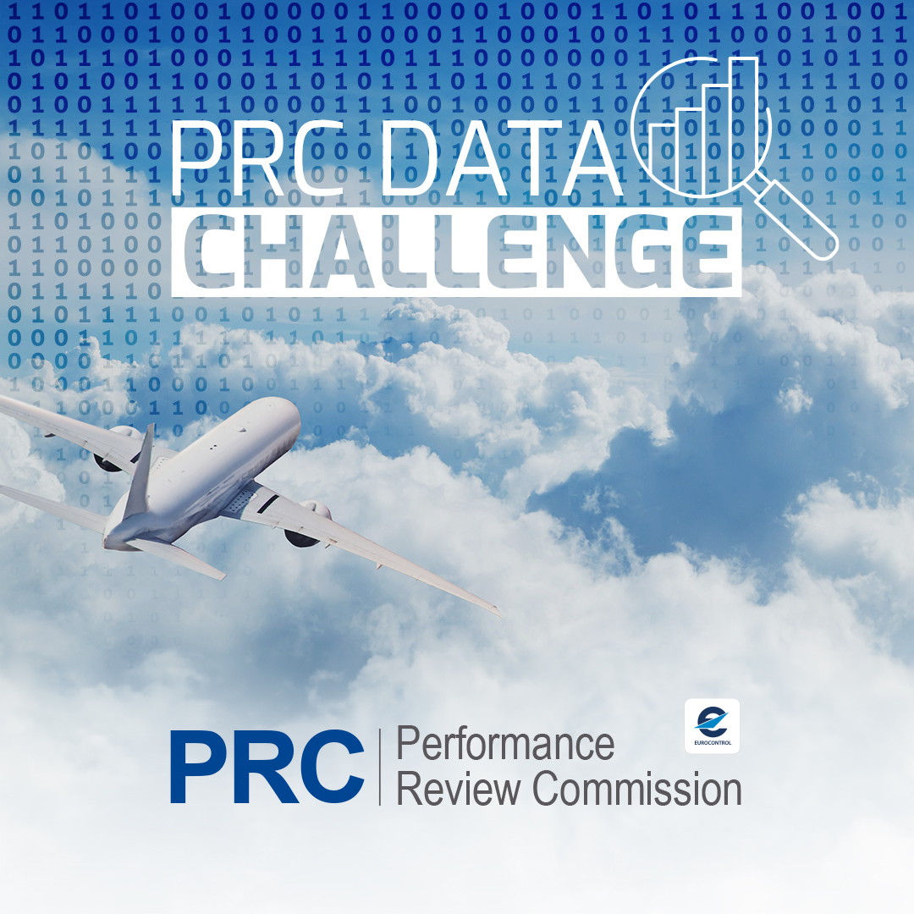
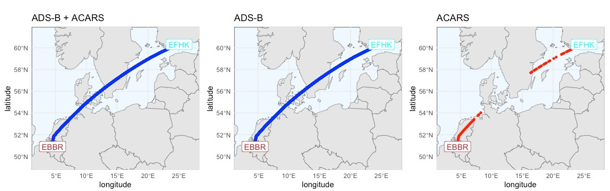
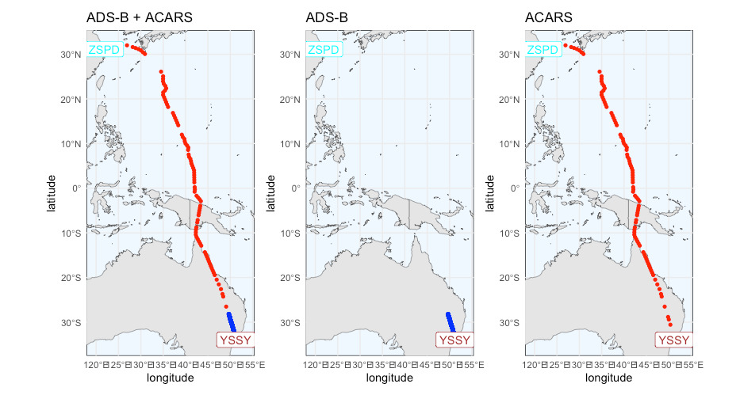

The \acr{PRC} with the support of [OpenSky Network](https://opensky-network.org/)
aims at engaging with data scientists, even without
Aviation background, to team up and compete to solve a (big-ish) Data Challenge
of interest to the wider Aviation community using open data and openly sharing
final solutions.

{width="540px" height="auto" alt="PRC Data Challenge"}

The 2025 edition of the \acr{PRC} Data Challenge builds on top of the 
[2024 edition](https://ansperformance.eu/study/data-challenge/dc2024/)
and proposes to build \acr{ML} models to predict the **amount of fuel
burnt** at certain intervals of the flight.
The training dataset will consist of flight intervals and corresponding fuel
burnt/flown amounts.

The competition runs (in two phases) from 1st Oct till 30th Nov 2025.  
The total amount for the first 3 teams is 5000 EUR.  
Check the conditions for [eligibility for prize](ranking.qmd#eligibility)
and then fill the following team creation request form!\

::: {.callout-important title="Important"}
# And the winners are...

  [see the dedicated page](outcome.qmd)

:::

::: {.callout-important title="Important"}
# Full dataset now openly available

The dataset (training and ranking) used for the organization of the challenge
is available at  
<https://doi.org/10.5281/zenodo.19184661>

and is described in a data paper openly accessible at  
<https://doi.org/10.59490/joas.2026.8750>

:::

Remember to follow up the data challenge on OSN's Discord
 channel [`#prc-data-competition`][prc-discord].  
(if not already done, you need to access [OSN Discord server](https://discord.gg/RPh89jpVVz) first)

--------------------------

Below you can find a couple of plots of flights showing 
the ACARS trajectory in [**red**]{fg="white" bg="red"} and the ADS-B
one in [**blue**]{fg="white" bg="blue"}.

::: {#fig-flights layout-nrow=2}

{#fig-flight-01}

{#fig-flight-01}

Flight trajectories in the challenge dataset.
:::

This is a data challenge that uses real data with all the inconsistencies,
noise, holes of the real world: it is a *challenge* because it is tough 
in its goal and in the available data, and not a mere tutorial or synthetic
exercise.

## Thanks

The organization of this challenge would have not been possible without the
creativity and dedication of Junzi Sun, the proficiency of John Fitzgerald and
the help of the *Friends of OSN*, Allan, Quinten, Martin, Rainer, Xavier and
Kamil among them.

{height=30px} OpenSky Network is of course the valuable organization without which we wouldn't
be able to assemble this challenge at all.

## Disclaimer

Please note that this challenge is a challenge in its own preparation, so 
**everything is experimental and subject to change at any moment
at the organizers' discretion**.  
We anyway do our best to prepare for an interesting and quality experience.

[prc-discord]: <https://discord.com/channels/1252625490930307142/1304403918515605504> "Discord channel for PRC Data Challenge"
