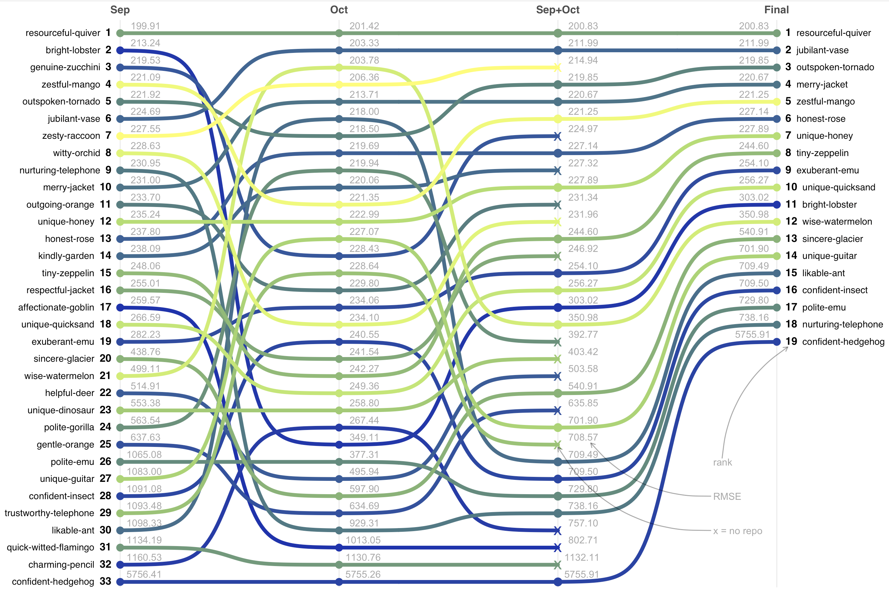

```{r setup, echo=FALSE, message=FALSE, warning=FALSE}
library(conflicted)
library(tidyverse)
library(here)
library(scales)

conflicts_prefer(dplyr::filter)

subs <- here("media", "submissions.csv") |> 
  read_csv()

plot_submissions <- function(subs, team, ylim = c(199, 300)) {
  subs |> 
    filter(teamName == team) |>
    ggplot() +
    aes(x = processedAt, y = score) +
    geom_line() + 
    geom_point(size = 1) + 
    coord_cartesian(
      xlim = c(as_datetime("2025-10-01"), as_datetime("2025-12-01")),
      ylim = ylim,
      expand = c(bottom = FALSE)) +
    labs(x = "date", y = "RMSE", title = team) +
    theme_minimal()
}
```

## Summary

The winners of the PRC Data Challenge 2025 are determined by

1. the ranking of the final submission (comprising fuel burnt predictions for
   both September and October 2025)
2. the provision of (decently commented ;-)) source code and relevant
   documentation describing the model and eventual design decisions.

All the publicly shared Github repositories have been forked under a dedicated
organization and are available at <https://github.com/prc-data-challenge-2025>.

The plot below shows the ranking evolution for the submissions in the
final phase of the challenge.

{.lightbox width='100%'}

You can remark quite some shifts of positions for some teams. 
We speculate that this could be due to overfitting and/or eventually 
to "learning" from the ranking algorithm.  

Inspired by an exchange with team 
[genuine-zucchini](teams/genuine-zucchini.qmd),
below you can find some revisited reproduction of the 
[RMSE evolution][rmse_evol] for some of the teams.


```{r, echo=FALSE, message=FALSE, warning=FALSE}
plot_submissions(subs, "resourceful-quiver")
plot_submissions(subs, "bright-lobster")
plot_submissions(subs, "jubilant-vase", c(199, 702))
```

It would be nice to dig into the commits and see what experiments were linked
to the jumps in RMSE...this is left as an exercise for the readers :innocent:
(or as a suggestion to the authors to write more about their attempts
at improving the RMSE.)


[rmse_evol]: <https://github.com/Gheed0123/PRC-Data-Challenge-2025/tree/main/leaderboard_plots>

## And the winners are...

1. team 1
   - team member 1  
   Spending voucher: 2500 EUR

1. team 2
   - team member 1
   - team member 2  
   Spending voucher: 1750 EUR

1. team 3
   - team member 1  
   Spending voucher: 750 EUR


-------------------------------

## Review of teams repos
In the following sections we summarize the review of the repo for each team.
Order is by "rank Final".


### resourceful-quiver, RMSE = 200.83, Rank = 1

Almost ready JOAS paper ([PDF][pdfpaper])!
Nice description: SUPER.

[pdfpaper]: <https://github.com/PRC-Data-Challenge-2025/resourceful-quiver/blob/main/PRC_2025_report.pdf>

The methodology is well founded and guided by domain knowledge and not solely
by ML techniques, i.e. uses mass estimator learning from last year's challenge.

Jupyter notebook as sparse with comments.  
Python scripts/modules are somewhat commented but sparsely.  


### jubilant-vase, RMSE = 211.99, Rank = 2

Distilled documentation.  
Scripts are well documented and structured.  
Uses mass estimation as per last year's challenge.  
Uses ensemble of three gradient boosting libraries.


### outspoken-tornado, RMSE = 219.85, Rank = 3

More ML approach, i.e. feature engineering not too domain specific.  
Some trajectory features, mean/max TAS, mean vertical rate...but no checks on
outlier/absurd values.

Code is structured (over-structured?)


### merry-jacket, RMSE = 220.67, Rank = 4

Nice README but short-ish.  
No TOW estimation.  
Some features from domain and data for aircraft type.  
Uses ensemble of 2 models.


### zestful-mango, RMSE = 221.25, Rank = 5

commit on 1st Dec.  
Some comments and mostly in Spanish.  
Not much rationale of design decisions, feature selection.


### honest-rose, RMSE = 227.14, Rank = 6

Nice description of the various features added in different stages in PDF
with rationale for choices.  
Used weather features but found not so influential...  
Used economic features (oil price)...but found not so influential.  
No TOW.  
Cannot find data `features_intervals.csv` mentioned in the code
(also hardcoded paths): make it more reproducible by somebody cloning and
using the challenge dataset.  
Code sparsely documented in `R scripts/`, somewhat better in `Python scripts/`.


### unique-honey, RMSE = 227.89, Rank = 7

Well structured and informative README.  
Links to extra data sources.  
Data cleanup is sound: remove outliers or unrealistic values.  
Uses ensemble of models.  
Not much info about feature engineering: the why's.  
Similarly to others, it uses flight phases.


### tiny-zeppelin, RMSE = 244.60, Rank = 8

Not much explicit info about where to start from, but it looks like
`orchestrator`.  
Hardcoded (MS Windows) paths...difficult to clone and reproduce
(on other OSs/machines.)  
Sparse/rare comments in code ;-). 
Uses flight phases.  
No why's.  


### exuberant-emu, RMSE = 254.10, Rank = 9

Hardcoded paths...  
No much rationale on choices nor about features engineering.  
Quite ML approach but not too domain-specific, yes mean/std vertical rate or
mean mach, but not more.  


### unique-quicksand, RMSE = 256.27, Rank = 10

Nice analysis of noise in the data.  
Developed a simple model first and then used `xgboost` but not great vs
the leading team, so resolved to stick to the more robust initial model
for the final submission.


### bright-lobster, RMSE = 303.02, Rank = 11

Good unique entry point: designed for reproducibility!!!  
It uses METAR and passenger stats.


### wise-watermelon, RMSE = 350.98, Rank = 12


### sincere-glacier, RMSE = 540.91, Rank = 13


### unique-guitar, RMSE = 701.90, Rank = 14


### likable-ant, RMSE = 709.49, Rank = 15


### confident-insect, RMSE = 709.50, Rank = 16


### polite-emu, RMSE = 729.80, Rank = 17


### nurturing-telephone, RMSE = 738.16, Rank = 18


### confident-hedgehog, RMSE = 5755.91 , Rank = 19


